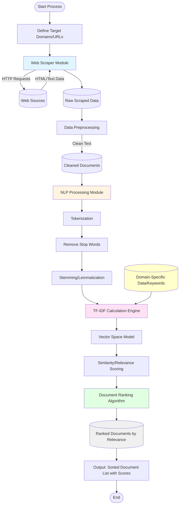

## System Architecture

```mermaid
graph TB
    Start([Start Process]) --> Input[Define Target Domains/URLs]
    
    Input --> Scraper[Web Scraper Module]
    
    Scraper --> |HTTP Requests| WebSources[(Web Sources)]
    WebSources --> |HTML/Text Data| Scraper
    
    Scraper --> RawData[(Raw Scraped Data)]
    
    RawData --> Preprocess[Data Preprocessing]
    Preprocess --> |Clean Text| CleanData[(Cleaned Documents)]
    
    CleanData --> NLP[NLP Processing Module]
    
    NLP --> Tokenize[Tokenization]
    Tokenize --> StopWords[Remove Stop Words]
    StopWords --> Stem[Stemming/Lemmatization]
    
    Stem --> TFIDF[TF-IDF Calculation Engine]
    
    DomainData[(Domain-Specific Data/Keywords)] --> TFIDF
    
    TFIDF --> VectorSpace[Vector Space Model]
    VectorSpace --> Similarity[Similarity/Relevance Scoring]
    
    Similarity --> Ranking[Document Ranking Algorithm]
    
    Ranking --> Results[(Ranked Documents by Relevance)]
    
    Results --> Output[Output: Sorted Document List with Scores]
    
    Output --> End([End])
    
    style Scraper fill:#e1f5ff
    style NLP fill:#fff4e1
    style TFIDF fill:#ffe1f5
    style Ranking fill:#e1ffe1
    style Results fill:#f0f0f0
    style DomainData fill:#ffffcc
```
